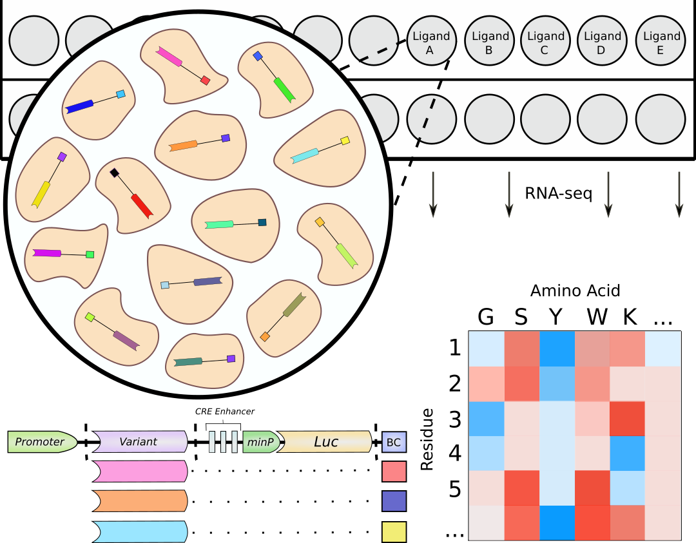

# Executive Summary
This document outlines our experimental platform for performing Deep Mutational Scan of the $\beta_2$ Adrenergic receptor, as well as a precursory analysis of our most recent experiments. Here we include details of how the assay works, and key results that emphasize the robustness and repeatability our assay.

```{r, init, echo=FALSE, message=FALSE, warning=FALSE}
# pretty plots!
library(gridExtra)
library(paletteer)
library(scales)
library(cowplot) # <- plot_grid
library(ggbeeswarm)
#library(ggrepel)

# clustering
library(factoextra)
library(uwot) # <- devtools::install_github("jlmelville/uwot")
library(dbscan)

# tidyverse
library(furrr); plan(multiprocess) # <- parallel map
library(corrr) # <- devtools::install_github("drsimonj/corrr")
library(stringr)
library(broom)
library(forcats)
library(magrittr)
library(tidyverse)

# setwd('~/Dropbox/Kosuri/ADRB2/')

# ---------------------------------------------------------------------

knitr::opts_chunk$set(fig.width = 16, fig.height = 9, dpi=300)
knitr::opts_chunk$set(fig.path = "./pipeline/")
knitr::opts_chunk$set(dev='png')
knitr::opts_chunk$set(warning=FALSE)
knitr::opts_chunk$set(echo=FALSE)

# see http://stackoverflow.com/q/36230790 to scroll output
# needs to be really big to prevent wrapping from happening before the scroll bar comes up
options(width = 240)

# ---------------------------------------------------------------------

theme_pub <- function(base_size = 13, base_family = "") {
  require(grid)
  # based on https://github.com/noamross/noamtools/blob/master/R/theme_nr.R
  # start with theme_bw and modify from there!
  theme_bw(base_size = base_size, base_family = base_family) +# %+replace%
    theme(
      # grid lines
      # panel.grid.major.x = element_line(colour="#ECECEC", size=0.5, linetype=1),
      #panel.grid.major.y = element_line(colour="#ECECEC", size=0.5, linetype=1),
      panel.grid.major.x = element_blank(),
      panel.grid.major.y = element_blank(),
      panel.grid.minor.x = element_blank(),
      panel.grid.minor.y = element_blank(),
      panel.background   = element_blank(),

      # axis options
      axis.ticks.y   = element_blank(),
      axis.title.x   = element_text(size=rel(2.25), vjust=0.25),
      axis.title.y   = element_text(size=rel(2.25), vjust=0.35),
      axis.text      = element_text(color="black", size=rel(1.5)),

      # legend options
      legend.title    = element_blank(),
      legend.key      = element_rect(fill="white"),
      legend.key.size = unit(1, "cm"),
      legend.text     = element_text(size=rel(2)),

      # facet options
      strip.text = element_text(size=rel(2)),
      strip.background = element_blank(),

      # title options
      plot.title = element_text(size=rel(2.25), vjust=0.25, hjust=0.5)
    )
}

# blank out grids for cowplot
theme_blank <- theme(
  panel.grid.major.x = element_blank(),
  panel.grid.minor.x = element_blank(),
  panel.grid.minor.y = element_blank(),
  panel.grid.major.y = element_blank(),
  panel.background   = element_blank()
)
# set the theme and brewer color
theme_set(theme_pub())
```

Load up.

```{r, loading-main, message=FALSE, warning=FALSE}
# ancillary files
aa.types <- read_delim('ancillary/aa-class.txt', delim = ' ')
wt.key <- read_delim('ancillary/wt-key.txt', delim = ' ')
wt.aa <- tibble(
  AA = system("tail -1 data/ADRB2_prot.fasta | fold -w1", intern=T),
  Pos = seq(2,414)
) %>%
  filter(Pos < 414) %>%
  mutate(
    Struct = case_when(
      Pos %in% seq(1, 25) ~ 'N-term',
      Pos %in% seq(26, 61) ~ 'TM1',
      Pos %in% seq(62, 65) ~ 'IC1',
      Pos %in% seq(66, 96) ~ 'TM2',
      Pos %in% seq(97, 101) ~ 'EC1',
      Pos %in% seq(102, 137) ~ 'TM3',
      Pos %in% seq(138, 145) ~ 'IC2',
      Pos %in% seq(146, 172) ~ 'TM4',
      Pos %in% seq(173, 195) ~ 'EC2',
      Pos %in% seq(196, 237) ~ 'TM5',
      Pos %in% seq(238, 261) ~ 'IC3',
      Pos %in% seq(262, 299) ~ 'TM6',
      Pos %in% seq(300, 303) ~ 'EC3',
      Pos %in% seq(304, 328) ~ 'TM7',
      Pos %in% seq(329, 341) ~ 'H8',
      Pos %in% seq(342, 413) ~ 'C-term',
      TRUE ~ 'Other'
    ) %>%
      factor(levels =c('N-term', 'TM1', 'IC1', 'TM2', 'EC1',
                       'TM3', 'IC2', 'TM4', 'EC2', 'TM5',
                       'IC3', 'TM6', 'EC3', 'TM7', 'H8', 'C-term'))
  ) %>%
  inner_join(aa.types, by = 'AA')

numbering <- read_csv('./ancillary/b2-gpcrdb.csv', col_names = c('gpcr_db', 'bw', 'sb', 'b2')) %>%
  mutate(
    WT_AA = str_sub(b2,1,1),
    Pos = as.numeric(str_sub(b2,2))
  )

boundaries <- wt.aa  %>%
    group_by(Struct) %>%
    summarise(Pos = max(Pos))

#-------------------------------------------------------------------------------
# Treatment data
bc.counts.3 <- read_delim(
  'output/drug-3_idx-bcs-counts.txt.gz',
  delim = ' ',
  col_names = c('Index', 'Barcode', 'Count'),
  col_types = 'cci'
) %>%
  # add index information and reads per index
  inner_join(
    read_delim('data/drug-3_idx-key.txt', delim = ' '),
    by = 'Index'
  ) %>%
  select(-Index) %>%
  mutate(Repeat = as.integer(Repeat))

bc.counts.7 <- read_delim(
  'output/drug-7_cond-bcs-counts.txt.gz',
  delim = ' ',
  col_names = c('Condition', 'Repeat', 'Barcode', 'Count'),
  col_types = 'cici'
) %>%
  mutate(
    Condition = case_when(
      Condition == '150' ~ '0.150',
      Condition == '625' ~ '0.625',
      TRUE ~ Condition
    ),
    Repeat = as.integer(Repeat)
  )

bc.counts <- bind_rows(bc.counts.3, bc.counts.7) %>%
  mutate(
    Forsk_Expr = case_when(Condition %in% c('0', '0.150', '0.625', 'F') ~ 'F',
                           Condition %in% c('5', 'F_5') ~ 'F_5')
  )

rm(bc.counts.3, bc.counts.7)
# write_csv(bc.counts, './pipeline/bc-counts.csv.gz')

#-------------------------------------------------------------------------------
# Barcode Mapping Data

single.mutants <-
  read_delim(
    'output/NextSeq_MiSeq.known-vars.txt.gz',
    #'~/Downloads/NextSeq_MiSeq.known-vars.txt.gz',
    delim = ' ',
    col_names = c('Barcode', 'MapReads', 'Variant'),
    col_types = 'cic'
  ) %>%
  mutate(
    Pos = as.integer(str_extract(Variant, '\\d+')) + 1, # account for Met
    AA = str_extract(Variant, '\\D$')
  )

#-------------------------------------------------------------------------------
# Neg controls

neg.controls <- read_tsv(
  './output/NextSeq_MiSeq.negs.txt.gz',
  col_names = c('Barcode', 'MapReads', 'CIGAR', 'Loc', 'Class'),
  col_types = 'cicic'
)

neg.controls %<>%
  filter(Class == 'Indel')  %>%
  semi_join(single.mutants) %>%
  select(Barcode) %>%
  anti_join(neg.controls, .)

#-------------------------------------------------------------------------------
# synonymous mutants

synon <- read_delim(
  './output/NextSeq_MiSeq.synon.translate.txt',
  delim = ' ',
  col_names = c('Barcode', 'MapReads')
)

#-------------------------------------------------------------------------------
# Forskolin Cutoffs/pseudocounts
F_Max <- 10
F_Min <- 0.2

reads <- bc.counts %>%
  count(Condition, Repeat, wt=Count) %>%
  rename(Reads = n) %>%
  mutate(Pseudo = 1 * Reads / min(Reads)) # <---- tune pc here

exprs <- bc.counts %>%
  select(Condition, Repeat) %>%
  distinct() %>%
  filter(!Condition %in% c('F', 'F_5')) %>%
  arrange(Condition, Repeat)
```

# Experimental Design
We first synthesized all ~8,000 missense variants of the $\beta_2$ Adrenergic receptor. We then cloned these variants upstream of a cyclic AMP (cAMP) responsive luciferase reporter that contains a unique DNA "barcode" sequence of the 3' untranslated region of the reporter (Figure labels: minP - minimal promoter, Luc - luciferase, BC - barcode). This barcode uniquely identifies the variant cloned upstream and allows us to measure that variant's function by RNA-seq. We then integrated the entire variant-reporter cassette at single copy in a defined loci on the HEK293T genome. This ensures that a variant's activity is linked only to its associated genetic reporter.

In this experiment, we incubated our heterogeneous cell line containing multiple redundant copies of all ~8,000 variants with 0, 0.15, 0.625, and 5 $\mu$M isoproterenol in two biological replicates. We then isolated and sequenced the RNA corresponding to our barcodes. In order to estimate the copy number of each variant, we also incubated our cell line with forskolin to induce expression of our reporter without activating our $\beta_2$ mutants. We could then use the ratio of barcode abundance in the isoproterenol and forskolin conditions as a measurement of fitness.

```{r, test, fig.width=10.8, fig.height=8.43}

```

# Preprocessing

## Repeatability 
Let's see how well our measurements correspond at the barcode level.

```{r, bc-corrs}
# enable parallel correlation testing
cor.help <- function(df) {
  df %>%
    spread(Repeat, Norm) %$%
    cor.test(`1`, `2`, na.action = 'complete.obs') %>%
    tidy()
}

bc.counts %>%
  inner_join(reads) %>%
  mutate(Norm = log10(Count / (Reads / 1e6))) %>%
  select(Barcode, Condition, Repeat, Norm) %>%
  group_by(Condition) %>%
  nest() %>%
  mutate(Cor = future_map(data, cor.help)) %>%
  select(-data) %>%
  unnest() %>%
  arrange(Condition)

bc.corr.plot <- bc.counts %>%
  filter(Condition == '0.625') %>%
  inner_join(reads) %>%
  mutate(Norm = Count / (Reads / 1e6)) %>%
  select(Barcode, Norm, Repeat) %>%
  spread(Repeat, Norm) %>%
  sample_n(500000) %>%
  ggplot(aes(x=`1`, y=`2`)) +
  geom_abline() +
  geom_hex(bins=100, aes(fill=log10(..count..))) +
  scale_fill_paletteer_c(viridis, plasma) +
  scale_x_log10(
    labels=comma,
    limits=c(NA,100)
  ) +
  scale_y_log10(
    labels=comma,
    limits=c(NA,100)
  ) +
  annotation_logticks() +
  labs(
    x = 'Repeat 1 (RPM)',
    y = 'Repeat 2 (RPM)',
    title = 'Barcodes'
  ) +
  theme(legend.position = 'none')
bc.corr.plot
```

## Experimental Changes
We can also track the effect of experimental modulation

```{r, corr-over-time}
bc.counts.2 <- read_delim(
  'output/drug-2_idx-bcs-counts.txt.gz',
  delim = ' ',
  col_names = c('Index', 'Barcode', 'Count'),
  col_types = 'cci'
) %>%
  # add index information and reads per index
  inner_join(
    read_delim('data/drug-2_idx-key.txt', delim = ' '),
    by = 'Index'
  ) %>%
  select(-Index) %>%
  mutate(
    Repeat = as.integer(Repeat),
    Day = 1L
  ) %>%
  filter(Condition == '0.625')

bc.counts.6 <- read_delim(
  'output/drug-6_cond-bcs-counts.txt.gz',
  delim = ' ',
  col_names = c('Condition', 'Repeat', 'Barcode', 'Count'),
  col_types = 'cici'
) %>%
  mutate(
    Condition = case_when(
      Condition == '150' ~ '0.150',
      Condition == '625' ~ '0.625',
      TRUE ~ Condition
    ),
    Repeat = as.integer(Repeat),
    Day = 2L
  ) %>%
  filter(Condition == '0.625')

days.625 <- bc.counts %>%
  filter(Condition == '0.625') %>%
  select(-Forsk_Expr) %>%
  mutate(Day = 3L) %>%
  bind_rows(bc.counts.2) %>%
  bind_rows(bc.counts.6)
rm(bc.counts.2, bc.counts.6)

# normalize counts
days.625 %<>%
  count(Day, Repeat, wt=Count) %>%
  rename(Reads = n) %>%
  inner_join(days.625) %>%
  mutate(Norm = log10(Count / (Reads / 1e6))) 

# corr calc
days.625 %>%
  select(Day, Repeat, Barcode, Norm) %>%
  group_by(Day) %>%
  nest() %>%
  mutate(Cor = future_map(data, cor.help)) %>%
  select(-data) %>%
  unnest()

#12:6
days.625 %>%
  select(Day, Repeat, Barcode, Norm) %>%
  group_by(Day) %>%
  nest() %>%
  mutate(foo = map(data, ~spread(.x, Repeat, Norm) %>% sample_n(500000))) %>%
  select(-data) %>%
  unnest() %>%
  ggplot(aes(x=`1`, y=`2`)) +
  geom_abline() +
  geom_hex(bins=100, aes(fill=log10(..count..))) +
  scale_fill_paletteer_c(viridis, plasma) +
  scale_x_log10(
    labels=comma,
    limits=c(NA,10)
  ) +
  scale_y_log10(
    labels=comma,
    limits=c(NA,10)
  ) +
  annotation_logticks() +
  facet_wrap(~ Day, nrow=1) +
  labs(
    x = 'Repeat 1 (RPM)',
    y = 'Repeat 2 (RPM)'
  ) 
rm(days.625)
```

## Forskolin Normalization

Before we aggregate our barcodes together into variants (see Appendix) to, we must first normalize to their copy number by using forskolin as a proxy. At this stage, the concept of a repeat breaks down (due to some experimental considerations). However, we do keep experiments performed on different days separate.

We will set a minimum read cutoff in our forskolin condition to ensure that variants that we pseudocount in the drug conditions will be real. Plotting the distributions of read counts per barcocde for our forskolin conditions, we have

```{r, forsk-reads}
f.cutoffs.int <- reads %>%
  filter(Condition %in% c('F', 'F_5')) %>%
  mutate(Cutoff = F_Min) %>%
  mutate(Count = round(Cutoff * (Reads/1e6)))

bc.counts %>%
  filter(Condition %in% c('F', 'F_5')) %>%
  mutate(Count = if_else(Count > 30, 30L, Count)) %>%
  ggplot(aes(x=Count)) +
  geom_histogram(binwidth = 1) +
  geom_vline(
    data=f.cutoffs.int,
    aes(xintercept=Count),
    color='red'
  )+
  facet_grid(Repeat ~ Condition) +
  scale_x_continuous(
    breaks=seq(0,30),
    labels=c(seq(0,29), '30+')
  ) +
  scale_y_log10() +
  annotation_logticks(sides = 'l')

rm(f.cutoffs.int)
```

In addition, we will average the result together, drop any barcodes that are not present in both repeats, and that the mean value pass the read filter. For the drug conditions, we will set any missing value to a pseudocount. (This will take a while ~10-15 mins depending on how many cores are avalible)

```{r, forsk-ratio}
# dplyr grinds to a halt if there are a ton of groups (e.g. millions of bcs)
# amazingly, it's faster to spread the data and manually calc the average
avg.help <- function(df) {
  df %>%
    select(Forsk_Expr, Barcode, Repeat, F_Norm) %>%
    spread(Repeat, F_Norm) %>%
    mutate(Avg = (`1` + `2`) / 2) %>%
    filter(!is.na(Avg)) %>%
    select(Barcode, Forsk_Expr, F_Norm = Avg)
}

forsk <- bc.counts %>%
  filter(Condition %in% c('F', 'F_5')) %>%
  inner_join(reads, by = c('Condition', 'Repeat')) %>%
  mutate(F_Norm = Count / Reads) %>%
  group_by(Condition) %>%
  nest() %>%
  mutate(foo = future_map(data, avg.help)) %>%
  select(-data) %>%
  unnest() %>%
  select(-Condition)

forsk.ratio.raw <- bc.counts %>%
  filter(!Condition %in% c('F', 'F_5')) %>%
  group_by(Condition, Repeat, Forsk_Expr) %>%
  nest() %>%
  # add explicit 0's to bc's missing from forsk
  # filter ensures we're joining the right forsk condition
  mutate(
    foo = future_map2(data, Forsk_Expr,
               ~right_join(.x, filter(forsk, Forsk_Expr == .y), by = 'Barcode')
    )
  ) %>%
  select(-data, -Forsk_Expr) %>%
  unnest() %>%
  replace_na(list(Count = 0L)) %>%
  inner_join(reads) %>%
  group_by(Condition, Repeat) %>%
  mutate(
    Is_Pseudo = if_else(Count == 0, T, F),
    Norm = (Count + Pseudo) / (Reads + n()*Pseudo),
    Ratio = Norm / F_Norm
  ) %>%
  ungroup()
```

Now that we have normalized each barcode to its copy number, we will filter out the nosiest population

### Copy Number Filtering

We suspect that one of the largest sources of noise will come from variants that have a low cellular representation. Using forskolin as a proxy, we will plot the deviation from the mean variant value  $Dist = \log_{10}(Ratio) - mean(\log_{10}(Ratio))$, where $Ratio = \frac{Count/Reads}{Count_{Forskolin}/Reads_{Forskolin}}$. To aid in visualization, we will plot the barcodes for 800 mutants.

```{r, mean-dev}
forsk.ratio.raw %>%
  inner_join(single.mutants, by = 'Barcode') %>%
  inner_join(
    single.mutants %>%
      select(Pos, AA) %>%
      distinct() %>%
      sample_n(800)
  ) %>%
  group_by(Condition, Repeat, Pos, AA) %>%
  mutate(
    Mean = mean(log10(Ratio)),
    Dist = log10(Ratio) - Mean
  ) %>%
  ungroup() %>%
  ggplot(aes(x=F_Norm * 1e6, y=Dist)) +
  geom_hline(yintercept=0, color='black', linetype='dashed') +
  geom_point(alpha=0.1, aes(color=Is_Pseudo)) +
  geom_smooth(se=F, method='loess', aes(color=Is_Pseudo)) +
  geom_smooth(se=F, method='loess', color='black') +
  geom_vline(xintercept = F_Max, color = 'black', linetype='dashed') +
  geom_vline(xintercept = F_Min, color = 'black', linetype='dashed') +
  facet_grid(Repeat ~ Condition) +
  scale_x_log10() +
  scale_color_manual(values=c('#009B9E','#C75DAB')) +
  annotation_logticks(sides='b') +
  labs(
    x = 'Forskolin Counts (Reads per Million)',
    y = expression(log[10]~Distance~From~Mean)
  ) +
  theme(legend.position = 'Bottom')
```

We see that barcodes with low copy-number tend to over-estimate the mean, while high copy-number variants under-estimate it. Thus, we will remove these variants from the population

```{r, forsk-filter}
forsk.ratio <- forsk.ratio.raw %>%
  filter(
    F_Norm * 1e6 > F_Min,
    F_Norm * 1e6 < F_Max
  )

# link to library and negative controls
single.mutant.expression <- forsk.ratio %>%
  inner_join(single.mutants, by = 'Barcode')

# subtract 69 bp for the FLAG-tag, 1 to make numbering nice
negs <- neg.controls %>%
  filter(Class == 'Indel') %>%
  mutate(Pos = (Loc - 70) %/% 3) %>%
  filter(Pos > 0) %>%
  inner_join(forsk.ratio)

# write_csv(forsk.ratio.raw, './pipeline/forsk-ratio-raw.csv')
rm(forsk.ratio.raw)
rm(bc.counts)
rm(forsk)
```

## Forskolin Repeatability

What do the correlations look like at this stage?

```{r, forsk-corr}
forsk.ratio %>%
  mutate(Ratio = log10(Ratio)) %>%
  select(Barcode, Condition, Repeat, Ratio) %>%
  spread(Repeat, Ratio) %>%
  group_by(Condition) %>%
  nest() %>%
  mutate(Cor = map(data, ~tidy(cor.test(.x$`1`, .x$`2`, na.action='complete.obs')))) %>%
  select(-data) %>%
  unnest()

forsk.ratio %>%
  filter(Condition == '0.625') %>%
  select(Barcode, Ratio, Repeat) %>%
  spread(Repeat, Ratio) %>%
  ggplot(aes(x=`1`, y=`2`)) +
  geom_abline() +
  geom_point(alpha=0.01) +
  scale_x_log10(labels=comma) +
  scale_y_log10(labels=comma) +
  annotation_logticks() +
  labs(
    x = 'Repeat 1 (AU)',
    y = 'Repeat 2 (AU)'
  )
```

## Variant Filtering

One possible source of noise could be coming from a lack of barcodes. We would assume that as the number of barcodes increase the CV should decrease

```{r, lib-dist}
lib.med <- single.mutant.expression %>%
  group_by(Condition, Repeat, Pos, AA) %>%
  summarise(
    Median = median(Ratio),
    MAD = mad(Ratio),
    Mean = mean(Ratio),
    SD = sd(Ratio),
    CV = SD / Mean,
    N = n()
  ) %>%
  ungroup()

lib.med %>%
  ggplot(aes(x=N, y=CV)) +
  geom_point(alpha=0.01) +
  facet_grid(Repeat~Condition) +
  geom_smooth()
```

We see that this is not the case.

## Barcode vs Variant Correlation

```{r, corrs}
lib.med %>%
  mutate(Mean = log10(Mean)) %>%
  select(Condition, Repeat, Pos, AA, Mean) %>%
  spread(Repeat, Mean) %>%
  group_by(Condition) %>%
  nest() %>%
  mutate(Cor = map(data, ~tidy(cor.test(.x$`1`, .x$`2`, na.action='complete.obs')))) %>%
  select(-data) %>%
  unnest()

lib.corr.plot <- lib.med %>%
  filter(Condition == '0.625') %>%
  select(Pos, AA, Repeat, Mean) %>%
  spread(Repeat, Mean) %>%
  ggplot(aes(x=`1`, y=`2`)) +
  geom_abline() +
  geom_hex(bins=100, aes(fill=log10(..count..))) +
  scale_x_log10(labels=comma) +
  scale_y_log10(labels=comma) +
  scale_fill_paletteer_c(viridis, plasma) +
  annotation_logticks() +
  labs(
    x = 'Repeat 1 (AU)',
    y = 'Repeat 2 (AU)',
    title = 'Missense Variants'
  ) +
  theme(legend.position = 'none')

# aspect 9:9
plot_grid(bc.corr.plot, lib.corr.plot, nrow=2)
```

## PositiveNegative Controls

### Negative Control Normalization

Next, we need to account for how our data is changing across conditions. Since we used chip-synthesized oligos to generate our library, we expect a large proportion of our library to be frameshifts. We can use these frameshifts as a sort of "spike-in" control if they do not respond to drug. Plotting our frameshifts by position, we have

```{r, neg-control-pos}
negs.med <- negs %>%
  group_by(Condition, Repeat, Pos) %>%
  summarise(
    Median = median(Ratio),
    MAD = mad(Ratio),
    Mean = mean(Ratio),
    SD = sd(Ratio),
    CV = SD / Mean,
    N = n(),
    AA = 'Indel'
  ) %>%
  ungroup()

negs.by.pos <- exprs %>%
  inner_join(negs.med) %>%
  mutate(
    Condition = paste0(Condition, ' uM Iso'),
    Condition = if_else(Condition == '0 uM Iso', '-Iso', Condition)
  ) %>%
  ggplot(aes(x=Pos, y=Mean)) +
  geom_point() +
  geom_smooth(se=F) +
  geom_vline(xintercept = 330, linetype = 'dashed') +
  #scale_y_continuous(trans='log2') +
  facet_grid(Repeat ~ Condition) +
  labs(
    y = 'Forskolin Ratio',
    x = 'Position',
    title = 'Effect of Indel per Codon'
  )

#1600:900
negs.by.pos
```

We see that the effect is diminished shortly after the start of the unstructured C-terminus! Thus we will exclude these frameshifts from our negative control set.

### Positive vs. Negative Controls

Now that our positive and negative controls are normallized, we will plot the mean response for each condition.

```{r, wt-vs-negs}
# filter out negs < 330 (start of c-terminal tail)
negs.scale <- negs %>%
  filter(Pos < 330) %>%
  group_by(Condition, Repeat) %>%
  summarise(
    Scale_Median = median(Ratio),
    Scale_Mean = mean(Ratio),
    Scale_SD = sd(Ratio),
    Scale_N = n()
  ) %>%
  ungroup() %>%
  mutate(Variant = 'Indel')

scalars <- synon %>%
  inner_join(forsk.ratio) %>%
  group_by(Condition, Repeat) %>%
  summarise(
    Scale_Median = median(Ratio),
    Scale_Mean = mean(Ratio),
    Scale_SD = sd(Ratio),
    Scale_N = n(),
    Variant = 'Synon'
  ) %>%
  ungroup() %>%
  bind_rows(negs.scale)

wt.vs.negs <- scalars %>%
  ggplot(aes(x=as.numeric(Condition), y=Scale_Mean, color=Variant)) +
  geom_point() +
  stat_summary(fun.y = mean, geom = 'line', lwd = 1)

wt.vs.negs
```

We see that our frameshifts and WT reads are decreasing as a function of isoproterenol concentration. This is at ends with the expectation that frameshifts should not respond to isoproterenol stimulation. We hypothesize that both curves are decreasing as the drug concentration increases because more of the functionally retarded mutants will be activated, thereby "stealing" reads from fully active mutants. Thus, by normalizing to the mean negative control value (which should remain constant regardless of drug concentration) at each condition for each repeat we can account for the change in reads per variant. 

```{r, negs-norm}
negs.norm <- scalars %>%
  filter(Variant == 'Indel') %>%
  select(Condition, Repeat, Select_Mean = Scale_Mean) %>%
  inner_join(scalars) %>%
  ggplot(aes(x=as.numeric(Condition), y=Scale_Mean/Select_Mean, color=Variant)) +
  geom_point() +
  stat_summary(fun.y = mean, geom = 'line', lwd = 1)

negs.norm
```

Normalizing to WT should also account for these changes and make our values easier to interpret in the process

```{r, wt-norm}
wt.norm <- scalars %>%
  filter(Variant == 'Synon') %>%
  select(Condition, Repeat, Select_Mean = Scale_Mean) %>%
  inner_join(scalars) %>%
  ggplot(aes(x=as.numeric(Condition), y=Scale_Mean/Select_Mean, color=Variant)) +
  geom_point() +
  stat_summary(fun.y = mean, geom = 'line', lwd = 1)

wt.norm
```

Interestingly, the negative controls do not remain flat after normalization. This implies that we have not fully accounted for the compositional effects in our library or that our synonymous mutants are problematic. Given what we know about how our synonymous mutants are detected, this is probably the case.

## Write out intermediate files

Since the first half of these calculations are quite expensive, we'll save an intermediate version of our data

```{r, for.eric}
# save intermediate data-frame
# write_csv(lib.med, './output/lib-med.csv.gz')
# write_csv(negs.med, './output/negs-med.csv.gz')
# write_csv(scalars, './output/scalars.csv')
# write_csv(exprs, './output/exprs.csv')

# do the class averaging here
class.norm.int <- single.mutant.expression %>%
  filter(F_Norm * 1e6 < F_Max) %>%
  inner_join(aa.types, by = 'AA') %>%
  group_by(Condition, Repeat, Pos, Class) %>%
  summarise(
    Mean = mean(Ratio),
    N = n()
  ) %>%
  ungroup()

# write_csv(class.norm.int, './output/class-norm-int.csv.gz')
```

# Final DF
We will use the standard propegation of uncertainty formula to combine the SDs from our two repeats $\sigma = \frac{1}{2\sqrt{\frac{\sigma^2_1}{\mu^2_1} + \frac{\sigma^2_2}{\mu^2_1}}$

```{r, final-df}
# forsk.ratio.raw <- read_csv('./pipeline/forsk-ratio-raw.csv.gz', col_types = 'ccidciiddldd')
# lib.med <- read_csv('./output/lib-med.csv.gz', col_names = T, col_types = 'ciicdddddi')
# negs.med <- read_csv('./output/negs-med.csv.gz', col_names = T, col_types = 'ciidddddic')
# scalars <- read_csv('./output/scalars.csv', col_names = T, col_types = 'cidddic')
# class.norm.int <- read_csv('./output/class-norm-int.csv.gz', col_names = T, col_types = 'ciicdi')
# exprs <- read_csv('./output/exprs.csv', col_names = T, col_types = 'ci')
# aa.types <- read_delim('./ancillary/aa-class.txt', delim = ' ')
# numbering <- read_csv('./ancillary/b2-gpcrdb.csv', col_names = c('gpcr_db', 'bw', 'sb', 'b2')) %>%
#   mutate(
#     WT_AA = str_sub(b2,1,1),
#     Pos = as.numeric(str_sub(b2,2))
#   )

#---------------------------------------------------------------------------------

variants.norm.raw <- lib.med %>%
  inner_join(scalars, by = c('Condition', 'Repeat')) %>%
  filter(Variant == 'Indel') %>% #<--------------------
  mutate(Norm = Mean / Scale_Mean) 

################################################################################
# CHOOSE NORMALIZATION HERE
################################################################################
# group by amino acid class to get extra power
class.norm.raw <- class.norm.int %>%
  inner_join(
    scalars %>% filter(Variant == 'Indel'), # <--------------------
    by = c('Condition', 'Repeat')
  ) %>%
  mutate(Norm = Mean / Scale_Mean) %>%
  select(Condition, Repeat, Pos, Class, Norm, N)

#-------------------------------------------------------------------------------
# Drop variants with high CV's and average repeats together

variants.norm <- variants.norm.raw %>%
  # filter(CV < 1) %>%
  group_by(Condition, Pos, AA) %>%
  summarise(
    Min = min(Norm),
    Max = max(Norm),
    Norm = mean(Norm),
    N = mean(N),
    Uncert = 0.5 * sqrt(sum(SD^2 / Scale_Mean^2)),
    PCV = Uncert / Norm
  ) %>%
  ungroup() %>%
  inner_join(aa.types, by = 'AA') %>%
    mutate(
    Struct = case_when(
      Pos %in% seq(1, 25) ~ 'N-term',
      Pos %in% seq(26, 61) ~ 'TM1',
      Pos %in% seq(62, 65) ~ 'IC1',
      Pos %in% seq(66, 96) ~ 'TM2',
      Pos %in% seq(97, 101) ~ 'EC1',
      Pos %in% seq(102, 137) ~ 'TM3',
      Pos %in% seq(138, 145) ~ 'IC2',
      Pos %in% seq(146, 172) ~ 'TM4',
      Pos %in% seq(173, 195) ~ 'EC2',
      Pos %in% seq(196, 237) ~ 'TM5',
      Pos %in% seq(238, 261) ~ 'IC3',
      Pos %in% seq(262, 299) ~ 'TM6',
      Pos %in% seq(300, 303) ~ 'EC3',
      Pos %in% seq(304, 328) ~ 'TM7',
      Pos %in% seq(329, 341) ~ 'H8',
      Pos %in% seq(342, 413) ~ 'C-term',
      TRUE ~ 'Other'
    ) %>%
      factor(levels =c('N-term', 'TM1', 'IC1', 'TM2', 'EC1',
                       'TM3', 'IC2', 'TM4', 'EC2', 'TM5',
                       'IC3', 'TM6', 'EC3', 'TM7', 'H8', 'C-term'))
  ) 

class.norm <- class.norm.raw %>%
  # filter(CV < 1) %>%
  group_by(Condition, Pos, Class) %>%
  summarise(
    Min = min(Norm),
    Max = max(Norm),
    SD = sd(Norm),
    Norm = mean(Norm),
    N = n()
  ) %>%
  ungroup() %>%
    mutate(
    Struct = case_when(
      Pos %in% seq(1, 25) ~ 'N-term',
      Pos %in% seq(26, 61) ~ 'TM1',
      Pos %in% seq(62, 65) ~ 'IC1',
      Pos %in% seq(66, 96) ~ 'TM2',
      Pos %in% seq(97, 101) ~ 'EC1',
      Pos %in% seq(102, 137) ~ 'TM3',
      Pos %in% seq(138, 145) ~ 'IC2',
      Pos %in% seq(146, 172) ~ 'TM4',
      Pos %in% seq(173, 195) ~ 'EC2',
      Pos %in% seq(196, 237) ~ 'TM5',
      Pos %in% seq(238, 261) ~ 'IC3',
      Pos %in% seq(262, 299) ~ 'TM6',
      Pos %in% seq(300, 303) ~ 'EC3',
      Pos %in% seq(304, 328) ~ 'TM7',
      Pos %in% seq(329, 341) ~ 'H8',
      Pos %in% seq(342, 413) ~ 'C-term',
      TRUE ~ 'Other'
    ) %>%
      factor(levels =c('N-term', 'TM1', 'IC1', 'TM2', 'EC1',
                       'TM3', 'IC2', 'TM4', 'EC2', 'TM5',
                       'IC3', 'TM6', 'EC3', 'TM7', 'H8', 'C-term'))
  ) 
```

## Frame Shifts and Mutational Tolerance

As the name would suggest, mutational tolerance is a given residue's ability to accept amino acid substitutions. For our purposes, we will bound activity between the frameshift and WT, and average the effects of all substitutions at a given position. This ensures that substitutions that result in better than WT activity or worse than the mean frameshift do not artificially bring the tolerance up or down.

```{r, frameshift-tolerance-track}
frameshifts <- negs.med %>%
  mutate(AA = '(-)') %>%
  inner_join(
    scalars %>%
      filter(Variant == 'Indel'),
    by = c('Condition', 'Repeat')
  ) %>%
  mutate(Norm = Mean / Scale_Mean) %>%
  group_by(Condition, Pos, AA) %>%
  summarise(Norm = mean(Norm)) %>%
  ungroup()

# tolerance is just the average effect of each mutation at a give pos
tolerance <- variants.norm %>%
  group_by(Condition, Pos) %>%
  summarise(Tolerance = mean(Norm)) %>%
  mutate(Rank = rank(Tolerance)) %>%
  ungroup()
```


# Validation

## Variant Distributions

Now that we are normalizing to the mean synonymous variant, let's see what the distributions of effects look like (excluding C-terminus from the frameshfits)

```{r, norm-dist}
negs.vs.indel <- negs.med %>%
  filter(Pos < 330) %>%
  inner_join(scalars, by = c('Condition', 'Repeat')) %>%
  filter(Variant == 'Indel') %>% # <--------------------
  mutate(Norm = Mean / Scale_Mean) %>%
  group_by(Condition, Pos, AA) %>%
  summarise(Norm = mean(Norm)) %>%
  ungroup() %>%
  bind_rows(
    variants.norm %>%
      select(Condition, Pos, AA, Norm)
  ) %>%
  mutate(
    AA = if_else(AA == 'Indel', 'Frameshift', 'Missense'),
    Condition = if_else(Condition == '0', '-Iso', paste(Condition, 'uM Iso'))
  )

# ASPECT 9:9
negs.vs.indel %>%
  ggplot(aes(x=Norm, color=AA)) +
  geom_vline(xintercept = 1, linetype = 'dashed') +
  geom_density(lwd=1.1) +
  scale_x_continuous(
    trans = 'log2',
    breaks = c(0.5, 1, 2, 4),
    labels = c(0.5, 1, 2, 4),
    limits = c(2^-1.5, 2^2.5)
  ) +
  facet_wrap(~ Condition, ncol=1) +
  scale_color_manual(values = c('#ca0020', '#0571b0')) +
  labs(
    x = 'Activity',
    y = 'Density'
  ) +
  theme(legend.position = 'bottom')

# sig test
negs.vs.indel %>%
  group_by(Condition) %>%
  nest() %>%
  mutate(foo = map(data, ~tidy(wilcox.test(Norm ~ AA, data=.x)))) %>%
  select(-data) %>%
  unnest()
```

## Negs by Position
Similar to before, we can plot the effect of frameshift relative to WT

```{r, negs-vs-wt}
# ASPECT 9:9
frameshifts %>%
  mutate(
    Condition = paste0(Condition, ' uM Iso'),
    Condition = if_else(Condition == '0 uM Iso', '-Iso', Condition)
  ) %>%
  ggplot(aes(x=Pos, y=Norm)) +
  geom_point() +
  geom_smooth(se=F) +
  geom_vline(xintercept = 330, linetype = 'dashed') +
  facet_wrap(~ Condition, ncol = 1) +
  scale_y_continuous(trans='log2') +
  labs(
    y = 'Activity',
    x = 'Position'
  )

# sig test
frameshifts %>%
  mutate(Group = if_else(Pos > 341, 'C-term', 'Other')) %>%
  group_by(Condition) %>%
  nest() %>%
  mutate(
    foo = map(data, ~tidy(wilcox.test(Norm ~ Group, data=.x)))
  ) %>%
  select(-data) %>%
  unnest() %>%
  select(-method)

frameshifts %>%
  mutate(Group = if_else(Pos > 341, 'C_term', 'Other')) %>%
  group_by(Condition, Group) %>%
  summarise(Med = median(Norm)) %>%
  spread(Group, Med) %>%
  ungroup() %>%
  mutate(Diff = C_term - Other)
```

## In Vitro Mutants
We have performed some luciferase assays on a few mutants during the development of our assay. We would expect that our data should align with their results.

```{r, luc-compare}
in.vitro <- tribble(
  ~Pos, ~AA,
  113, 'A',
  135, 'W',
  203, 'A',
  204, 'A',
  207, 'A',
  219, 'A'
)

luciferase <- read_csv('./ancillary/luciferase-raw.csv', col_names = T)

luciferase.graph <- luciferase %>%
  filter(Conc * 1e6 < 10) %>%
  group_by(Mutant, Conc) %>%
  summarise(
    Mean = mean(Value),
    SD = sd(Value),
    N = n()
  ) %>%
  ungroup() %>%
  inner_join(
    filter(., Mutant == 'WT') %>%
      select(Conc, WT_Mean = Mean, WT_SD = SD),
    by = 'Conc'
  ) %>%
  filter(Mutant != 'WT') %>%
  mutate(
    Norm = Mean / WT_Mean,
    Err = Norm * sqrt((SD/Mean)^2 + (WT_SD/WT_Mean)^2),
    Conc = if_else(Conc == 0, 2^-5, Conc * 1e6),
    Mutant = if_else(Mutant == 'WT', '0WT', Mutant),
    Group = if_else(Mutant %in% c('113A', '135W'), 'Null', 'Hypomorphic'),
    Group = fct_rev(Group),
    Assay = 'Individual'
  ) %>%
  select(Mutant, Condition = Conc, Norm, Uncert = Err, Group, Assay, N)

#-------------------------------------------------------------------------------

# normalize our data to WT instead of negative controls
in.vitro.graph <- lib.med %>%
  semi_join(in.vitro) %>%
  inner_join(scalars, by = c('Condition', 'Repeat')) %>%
  filter(Variant == 'Synon') %>%# <--------------------
  mutate(Norm = Mean / Scale_Mean) %>%
  group_by(Condition, Pos, AA) %>%
  summarise(
    Norm = mean(Norm),
    N = mean(N),
    Uncert = 0.5 * sqrt(sum(SD^2 / Scale_Mean^2)),
    PCV = Uncert / Norm
  ) %>%
  ungroup() %>%
  mutate(
    Condition = if_else(Condition == '0', 2^-5, as.numeric(Condition)),
    Group = if_else(Pos %in% c(113, 135), 'Null', 'Hypomorphic'),
    Group = fct_rev(Group),
    Mutant = paste0(Pos, AA),
    Assay = 'Multiplexed'
  ) %>%
  select(Mutant, Condition, Norm, Uncert, Group, Assay, N)

# aspect 9:6
bind_rows(in.vitro.graph, luciferase.graph) %>%
  ggplot(aes(x=Condition, y=Norm, color=Mutant)) +
  geom_hline(yintercept = 1, linetype = 'dashed', color='black') +
  geom_line(lwd=1) +
  geom_point(size=3) +
  geom_errorbar(aes(ymin=Norm - Uncert/sqrt(N), 
                    ymax=Norm + Uncert/sqrt(N)), 
                width=0.1) +
  facet_grid(Assay ~ Group, scales = 'free_y') +
  scale_color_brewer(palette = 'Dark2') +
  scale_x_continuous(
    trans = 'log2',
    breaks = 2^seq(-5,3,2),
    labels = c(0, 0.125, 0.5, 2, 8),
    limits = c(2^-5,2^3)
  ) +
  scale_y_continuous(
    trans = 'log2',
    breaks = c(0.0625, 0.125, 0.25, 0.5, 1),
    labels = c(0.0625, 0.125, 0.25, 0.5, 1),
    limits = c(0.03125, 2.1)
  ) +
  labs(
    y = 'Activity',
    x = 'Isoproterenol uM'
  ) +
  theme(legend.position = 'bottom') 
```

We see that our mutants broadly line up with the trends seen in our in-vitro assay (error bars are $\pm$ standard deviation). The null mutations 113A and 135W are strongly beneath the wild-type curve and show little to no induction. Similar to our luciferase data, 204A, 203A, and 219A do not reach wild-type levels of induction until high isoproterenol concentration. The most egregious deviation from the luciferase data is the 207A mutant. While it is significantly higher than wild-type at 0 and 0.150 $\mu$M, the large variation of the measurements suggests that this is a particularly noisey mutant.

## Heatmaps

Now that we have a high-confidence dataset, we can generate a heatmap of every mutation in the $\beta_2$ Adrenergic receptor.

### External DBs
Let's use EVMutation and Sequence Conservation to make a track

```{r, ev-cons-track}
# conservation/ev mutation
species <- read_tsv(
  './ancillary/cons/species_js.tsv',
  col_names = c('Score', 'AA')
  ) %>%
  mutate(Pos = seq(1,413))

ev <- read_delim('./ancillary/cons/ev-mut.csv', delim = ';', col_types = cols(
  prediction_epistatic = "d",
  prediction_independent = "d",
  frequency = "d",
  column_conservation = "d"
)) %>%
  rename(Pos = pos, WT_AA = wt, AA = subs, Variant = mutant)

# flip the sign of EV mutation so that strong signals are high
# then 0-1 normalize so it fits on conservation scale
ev.mean <- ev %>%
  group_by(Pos) %>%
  summarise(Norm = -mean(prediction_epistatic)) %>%
  mutate(
    Norm = (Norm - min(Norm)) / (max(Norm) - min(Norm)),
    AA = 'EVmut.',
    Condition = 'Misc'
  )

cons <- species %>%
  filter(Pos > 1) %>%
  rename(Norm = Score) %>%
  mutate(
    Norm = Norm,
    AA = 'Cons.',
    Condition = 'Misc'
  )

general.tracks <- bind_rows(ev.mean, cons) %>%
  ggplot(aes(x=Pos, y=AA, fill=Norm)) +
  geom_raster() +
  geom_vline(data=boundaries, aes(xintercept = Pos), color='Red') +
  scale_fill_gradientn(
    colors=paletteer_c(scico, devon, direction=-1, 256), 
    limits = c(0, 1)
  ) +
  labs(
    x = 'Position',
    y = 'Arbitrary Units'
  ) +
  theme_void() +
  theme(legend.position = 'none') +
  coord_equal(ratio = 5)
```

### All Heatmaps

```{r, heatmaps}
# add the wt values back into the heatmap
wt.scale <- scalars %>%
  select(-Scale_Median, -Scale_N, -Scale_SD) %>%
  spread(Variant, Scale_Mean) %>%
  mutate(Norm = Synon / Indel) %>%
  group_by(Condition) %>%
  summarise(Norm = mean(Norm))

wt.pad <- tibble(
  Pos = rep(seq(2,413), 4), 
  Condition = c(rep('0', 412), rep('0.150', 412), rep('0.625', 412), rep('5', 412))
) %>%
  inner_join(wt.aa) %>%
  inner_join(wt.scale) %>%
  select(Condition, Pos, AA, Norm)
  
heatmaps <- variants.norm %>%
  select(Condition, Pos, AA, Norm) %>%
  # add frameshifts and WT back in
  bind_rows(filter(frameshifts, Pos > 1, Pos < 414)) %>%
  bind_rows(wt.pad) %>%
  mutate(
    Norm = log2(Norm),
    AA = factor(AA, levels = c('(-)', aa.types$AA))
  ) %>%
  ggplot(aes(x=Pos, y=AA, fill=Norm)) +
  geom_raster() +
  geom_vline(data=boundaries, aes(xintercept = Pos), color='Green') +
  scale_fill_gradientn(
    colors=paletteer_c(scico, lajolla, direction=-1, 256),
    limits = c(-0.5,2),
    oob=squish
  ) +
  facet_wrap(~ Condition, ncol=1) +
  theme_void() +
  theme(legend.position = 'none') +
  coord_equal(ratio = 1.5)

# aspect 30:30
plot_grid(
  heatmaps, general.tracks,
  align = 'v',
  ncol=1,
  axis = 'lr'
)
```

We see that broadly, charged residues have a negative effect on protein function when placed in the transmembrane domains. As expected, we also find that proline disrupts the transmembrane domains. Lastly, we see the that areas outside transmembrane domains (in particular the N- and C-termini) are fairly robust to mutations.

### Proline Helix

We expect there to be some obvious trends due to the highly helical nature of B2

```{r, proline}
#18:9
variants.norm %>%
  filter(AA == 'P') %>%
  mutate(
    Condition = paste0(Condition, ' uM Iso'),
    Condition = if_else(Condition == '0 uM Iso', '-Iso', Condition),
    Class = if_else(str_sub(Struct, 1, 2) == 'TM', 'Transmembrane Helix', 'Other')
  )  %>%
  ggplot(aes(x=Struct, y=log2(Norm), color=Class)) +
  geom_hline(yintercept = 0, linetype = 'dashed') +
  geom_boxplot() +
  facet_wrap(~Condition) +
  scale_color_manual(values = c('#7b3294', '#008837')) +
  labs(y = 'log2(Activity)') +
  theme(
    axis.text.x = element_text(angle = 315, hjust=0.1),
    axis.title.x = element_blank(),
    legend.position = 'bottom'
  ) 

pro.test <- variants.norm %>%
  filter(AA == 'P') %>%
  mutate(
    Group = case_when(
      str_sub(Struct, 1, 1) == 'T' ~ 'TM',
      str_sub(Struct, 1, 1) == 'I' ~ 'Loop',
      str_sub(Struct, 1, 1) == 'E' ~ 'Loop',
      str_sub(Struct, 1, 1) == 'H' ~ 'Helix 8',
      TRUE ~ 'Termini'
    )
  ) 

pro.test %>%
  group_by(Condition, Group) %>%
  summarise(Mean = mean(Norm), Median = median(Norm)) 

pro.test %>%
  group_by(Condition) %>%
  nest() %>%
  mutate(foo = map(data, ~tidy(pairwise.wilcox.test(.x$Norm, .x$Group, p.adjust.method = 'none')))) %>%
  select(-data) %>%
  unnest() %>%
  spread(group2, p.value)
```

\clearpage

# Evolution/Genomics
Here we will incorporate data from a variety of external databases to see if they match up with our observations

## EVMutation
EVMutation is an unsupervised statistical method that uses evolutionary constraints to predict effects of mutations on a protein (see Hopf *et al* Nature Biotech, 2017 for more details). Fortunately pre-computed predictions for ADRB2 already exists so we can simply download it and see how it compares to our data!

```{r, ev-plot}
ev.compare <- variants.norm %>%
  inner_join(ev, by = c('Pos', 'AA'))

# ASPECT 9:9
ev.compare %>%
  mutate(
    Condition = paste0(Condition, ' uM Iso'),
    Condition = if_else(Condition == '0 uM Iso', '-Iso', Condition)
  ) %>%
  ggplot(aes(x=prediction_epistatic, y=Norm)) +
  geom_point(alpha=0.1) +
  geom_smooth(method = 'lm', se=F, color='#0571b0') +
  facet_wrap(~ Condition, ncol = 1) +
  scale_y_continuous(
    trans='log2', 
    limits = c(2^-6, 2^4),
    breaks = 2^(seq(-6,4,2)),
    labels = c('1/64', '1/16', '1/4', '1', '4', '16')
  ) +
  labs(
    y = 'Activity',
    x = 'EVmutation Score'
  )

ev.compare.int <- ev.compare %>%
  mutate(Norm = log2(Norm)) %>%
  select(Condition, Pos, AA, Norm, prediction_epistatic,
         prediction_independent, column_conservation, frequency) %>%
  gather(Metric, Value, prediction_epistatic:frequency) %>%
  group_by(Condition, Metric) %>%
  nest() %>%
  mutate(
    P = map(data, ~cor.test(.$Value, .$Norm, method='spear', exact=F) %>% glance())
  ) %>%
  select(-data) %>%
  unnest() %>%
  select(Condition, Metric, Rho=estimate, p.value) %>%
  arrange(Condition)

ev.compare.int %>%
  filter(Metric == 'prediction_epistatic')
```

we see that EV mutations is a relatively poor predictor of our assay, with an average Spearman's $\rho =$ `r ev.compare.int %>% filter(Metric == 'prediction_epistatic') %>% summarise(Cor = round(mean(Cor), 3)) %$% Cor` and an average adjusted $R^2 =$ `r ev.compare.int %>% filter(Metric == 'prediction_epistatic') %>% summarise(R2 = round(mean(R2), 3)) %$% R2`.

However, averaging the predictions over each position and comparing them to the average mutational tolerance results in much better predictions.

```{r, ev-tolerance}
ev %>%
  group_by(Pos) %>%
  summarise(m_ev = mean(prediction_epistatic)) %>%
  inner_join(tolerance) %>%
  ggplot(aes(x=m_ev, y=Tolerance)) +
  geom_point() +
  geom_smooth(method = 'lm', se=F, color='#0571b0') +
  facet_wrap(~ Condition) +
  labs(
    title = 'Mutational Tolerance vs EVMutations',
    y = 'Mutational Tolerance',
    x = 'Mean EVMutation Score'
  )

ev.compare.collapse.int <- ev %>%
  gather(Metric, Value, prediction_epistatic:column_conservation) %>%
  group_by(Metric, Pos) %>%
  summarise(Value = mean(Value)) %>%
  ungroup() %>%
  inner_join(tolerance) %>%
  group_by(Condition, Metric) %>%
  nest() %>%
  mutate(
    P = map(data, ~cor.test(.$Value, .$Tolerance, method='spear', exact=F) %>% glance())
  ) %>%
  select(-data) %>%
  unnest() %>%
  select(Condition, Metric, Rho=estimate, p.value) %>%
  arrange(Condition)

ev.compare.collapse.int %>%
  filter(Metric == 'prediction_epistatic')
```

The predictions continue to improve if we further segregate the data by transmembrane domain.

### EVConservation

We can also use EVMutation's internal sequence conservation score to try and predict our mutational tolerance data.

```{r, ev-cons}
ev %>%
  select(Pos, column_conservation) %>%
  distinct() %>%
  inner_join(tolerance) %>%
  ggplot(aes(x=column_conservation, y=Tolerance)) +
  geom_point() +
  geom_smooth(method='lm', se=F, color='#0571b0') +
  facet_wrap(~ Condition) +
  labs(
    title = 'Mutational Tolerance vs. EVMutation Conservation',
    y = 'Mutational Tolerance',
    x = 'EVMutation Conservation Score'
  )

ev.compare.collapse.int %>%
  filter(Metric == 'column_conservation')
```

Interestingly, we see that EVMutation's conservation score is arguable as good a predictor of mutational tolerance as its regular score (??)!

### EVMutation Off Axes

Let's see where EV Mutation is failing. Only take points with N > 1 to limit outliers

```{r, ev-off}
ev.fit <- ev.compare %>%
  filter(Condition == '0.625') %>%
  lm(log2(Norm) ~ prediction_epistatic, data=.) %>%
  augment() %>%
  bind_cols(
    filter(ev.compare, Condition == '0.625') %>% select(Pos, AA)
  )

ev.outliers <- bind_rows(
  ev.fit %>% top_n(10, -.std.resid),
  ev.fit %>% top_n(10, .std.resid)
) %>%
  select(Pos, AA, log2.Norm., prediction_epistatic, .std.resid) %>%
  mutate(Norm = 2^log2.Norm.)

#9:9
ev.compare %>%
  filter(Condition == '0.625') %>%
  ggplot(aes(x=prediction_epistatic, y=Norm)) +
  geom_smooth(method = 'lm', se=F, color='#0571b0') +
  geom_point(alpha=0.2) +
  # geom_label_repel(
  #   data=ev.outliers,
  #   aes(label = paste0(Pos,AA))
  # ) +
  scale_y_continuous(
    trans='log2', 
    limits = c(2^-4.1, 2^3),
    breaks = c(0.0625, 0.25, 1, 4),
    labels = c(0.0625, 0.25, 1, 4)
  ) +
  labs(
    y = 'Activity',
    x = 'EVmutation Score'
  )
```

## Conservation (Species Level)

Since EVMutation uses a large homology search, we will instead use ~50 ADRB2 orthologs as predicted by the OMA database to calculate sequence conservation by Jenson-Shannon Divergence (see Capra *et al*, Bioinformatics, 2007). We can then use this conservation to ask if mutations at conserved residues are more detrimental to protein function.

```{r, species-cor, message=FALSE, warning=FALSE}
species <- read_tsv(
  './ancillary/cons/species_js.tsv',
  col_names = c('Score', 'AA')
) %>%
  mutate(Pos = seq(413))

cons.int <- tolerance %>%
  inner_join(species, by = 'Pos') %>%
  ungroup() %>%
  mutate(
    Condition = paste0(Condition, ' uM Iso'),
    Condition = if_else(Condition == '0 uM Iso', '-Iso', Condition)
  )

# aspect 9:9
cons.int %>%
  ggplot(aes(y=Tolerance, x=Score)) +
  geom_point() +
  geom_smooth(method = 'lm', se=F, color='#0571b0') +
  facet_wrap(~ Condition, ncol = 1) +
  labs(
    #title = 'Mutational Tolerance vs. Conservation',
    y = 'Mutational Tolerance',
    x = 'Conservation Score'
  )

cons.cor <- cons.int %>%
  group_by(Condition) %>%
  nest() %>%
  mutate(
    P = map(data, ~cor.test(.$Score, .$Tolerance, method='spear', exact=F) %>% glance())
  ) %>%
  select(-data) %>%
  unnest() %>%
  select(Condition, Rho=estimate, p.value) %>%
  arrange(Condition)

cons.cor
```

We see that sequence conservation is a good predictor of mutational tolerance, with $\rho =$  and $R^2_{adj} =$.

Let's grab just 0.625 uM for a plot

```{r, species-625}
cons.int %>%
  filter(Condition == '0.625 uM Iso') %>%
  ggplot(aes(y=Tolerance, x=Score)) +
  geom_smooth(method = 'lm', se=F, color='#0571b0') +
  geom_point() +
  labs(
    #title = 'Mutational Tolerance vs. Conservation',
    y = 'Mutational Tolerance',
    x = 'Conservation Score'
  )
```

## Conservation (Class A GPCRs)

Similarly, we can look at how B2 differs from Class A GPCRs.

```{r, class-a-corr}
classa <- read_tsv(
  './ancillary/cons/class-a_js.tsv',
  col_names = c('Score', 'AA')
) %>%
  mutate(Pos = seq(413))

classa.int <- tolerance %>%
  inner_join(classa, by = 'Pos') %>%
  ungroup() %>%
  mutate(
    Condition = paste0(Condition, ' uM Iso'),
    Condition = if_else(Condition == '0 uM Iso', '-Iso', Condition)
  )

# 9:9
classa.int %>%
  ggplot(aes(y=Tolerance, x=Score)) +
  geom_point() +
  geom_smooth(method = 'lm', se=F, color='#0571b0') +
  facet_wrap(~ Condition, ncol = 1) +
  labs(
    #title = 'Mutational Tolerance vs. Conservation',
    y = 'Mutational Tolerance',
    x = 'Conservation Score'
  )

classa.cor <- classa.int %>%
  group_by(Condition) %>%
  nest() %>%
  mutate(
    P = map(data, ~cor.test(.$Score, .$Tolerance, method='spear', exact=F) %>% glance())
  ) %>%
  select(-data) %>%
  unnest() %>%
  select(Condition, Rho=estimate, p.value) %>%
  arrange(Condition)

classa.cor
```

Again, we'll single out 0.625 uM and highlight positions with the 5 largest studentized residuals from the fit

```{r, classa-625}
classa.625 <- classa.int %>%
  filter(Condition == '0.625 uM Iso')

top5 <- classa.625 %>%
  lm(Tolerance ~ Score, data=.) %>%
  augment() %>%
  bind_cols(wt.aa) %>%
  top_n(5, -.std.resid) %$%
  Pos

classa.625 %>%
  ggplot(aes(x=Score, y=Tolerance)) +
  geom_smooth(method='lm', se=F, color='#0571b0') +
  geom_point() +
  # geom_label_repel(
  #   data = filter(classa.625, Pos %in% top5),
  #   aes(label = paste0(AA,Pos))
  # ) +
  labs(
    y = 'Mutational Tolerance',
    x = 'Conservation Score'
  )
```

## gnomAD

Using genome/exome data from ~100,000 individuals, we can see how population variants affect $\beta_2$ function. We will compare everything to our negative control distribution and correct with FDR. Note, since we would be scaling everything by the same constant, we can just look at raw forskolin ratios. Additionally, we are only comparing within condition, so we won't have to account for compositional effects.

```{r, gnomAD-clean, message=FALSE, warning=FALSE}
gnomad <- read_csv('./ancillary/cons/gnomad.csv') %>%
  filter(Annotation == 'missense_variant') %>%
  mutate(
    PosChar = str_sub(Consequence, 6),
    Pos = as.numeric(str_sub(PosChar, end=-4)),
    Char = str_sub(PosChar, -3),
    AA = case_when(
      Char == 'Ala' ~ 'A', Char == 'Arg' ~ 'R', Char == 'Asn' ~ 'N',
      Char == 'Asp' ~ 'D', Char == 'Cys' ~ 'C', Char == 'Glu' ~ 'E',
      Char == 'Gln' ~ 'Q', Char == 'Gly' ~ 'G', Char == 'His' ~ 'H',
      Char == 'Ile' ~ 'I', Char == 'Leu' ~ 'L', Char == 'Lys' ~ 'K',
      Char == 'Met' ~ 'M', Char == 'Phe' ~ 'F', Char == 'Pro' ~ 'P',
      Char == 'Ser' ~ 'S', Char == 'Thr' ~ 'T', Char == 'Trp' ~ 'W',
      Char == 'Tyr' ~ 'Y', Char == 'Val' ~ 'V'
    ),
    Variant = paste(as.character(Pos), AA, sep='_')
  ) %>%
  # there's two different mutations that result in the same codon at pos 8
  # ignore one since the count is the same
  filter(!(Pos == 8 & Alternate == 'G')) %>%
  select(Pos, AA, `Allele Frequency`, `Allele Count`)

# use the frameshifts to generate a null distribution
# we can then use this to estimate LoF by setting a quantile cutoff
null.stats <- frameshifts %>%
  filter(Pos < 330) %>%
  group_by(Condition) %>%
  summarise(FS_Mean = mean(Norm), FS_SD = sd(Norm))

gnomad.int <- gnomad %>%
  inner_join(variants.norm, by = c('Pos', 'AA')) %>%
  inner_join(null.stats, by = 'Condition') %>%
  mutate(
    Category = case_when(
      Norm + Uncert/sqrt(N) < FS_Mean + 2*FS_SD ~ 'LoF', 
      TRUE ~ 'Other'
    ),
    Bin = case_when(
      `Allele Count` == 1 ~ 'Singleton',
      `Allele Frequency` < 1/10000 ~ '< 1/10,000',
      `Allele Frequency` < 1/1000 ~ '< 1/1,000',
      #`Allele Frequency` < 1/100 ~ '< 1/100',
      TRUE ~ '> 1/1,000'
    ),
    Bin = factor(Bin, levels = c('Singleton', '< 1/10,000', '< 1/1,000', '< 1/100', '> 1/1,000')),
    Condition = paste0(Condition, ' uM Iso'),
    Condition = if_else(Condition == '0 uM Iso', '-Iso', Condition)
  )

# 9:4.5
gnomad.int %>%
  filter(Condition == '0.625 uM Iso') %>%
  ggplot(aes(x=Bin, y=Norm, fill=Category, group=Category)) +
    geom_hline(
    aes(yintercept = FS_Mean + 2*FS_SD),
    linetype = 'dashed'
  ) +
  geom_hline(
    yintercept = 1
  ) +
  geom_pointrange(
    aes(ymin=Norm, ymax=Norm+Uncert/sqrt(N)),
    alpha=0.75,
    pch=21,
    color='black',
    lwd=0.5,
    fatten=8,
    position=position_jitter(width=0.3)
  ) +
  labs(
    x = 'Allele Frequency',
    y='Activity'
  ) +
  scale_y_continuous(
    trans='log2',
    breaks = 2^(-4:3),
    labels = 2^(-4:3)
  ) +
  scale_fill_manual(values = c('#e08214', '#542788')) +
  theme(legend.position = 'bottom')
```

# Activating and Deactivating Mutants
We are interested in finding mutants that have abnormally high or low activities. To ensure that we are not just selecting noise, we will require that the CV for any mutant is < 1. 

```{r, active-snake}
top100 <- variants.norm %>%
  filter(PCV < 1) %>%
  group_by(Condition) %>%
  top_n(100, wt=Norm) %>%
  ungroup() %>%
  mutate(Group = 'Top 100')

bottom100 <- variants.norm %>%
  filter(PCV < 1) %>%
  group_by(Condition) %>%
  top_n(100, wt=-Norm) %>%
  ungroup() %>%
  mutate(Group = 'Bottom 100')

# use complete to add explicit 0's for missing regions
top100 %>%
  bind_rows(bottom100) %>%
  count(Condition, Struct, Group) %>%
  complete(Struct, nesting(Condition, Group), fill = list(n=0)) %>%
  ggplot(aes(x=Struct, y=n, fill=Group)) +
  geom_col(position = 'dodge') +
  labs(
    y='Number of Mutations',
    x = 'Domain'
  ) +
  scale_fill_manual(values = c('#ca0020', '#0571b0')) +
  facet_wrap( ~ Condition, ncol=1) +
  theme(
    legend.position = 'bottom',
    panel.grid.major.y = element_line(colour="#ECECEC", size=0.5, linetype=1)
  ) 

# only top100
top100 %>%
  filter(Condition == '0') %>%
  count(Struct) %>%
  right_join(boundaries) %>%
  replace_na(list(n=0L)) %>%
  ggplot(aes(x=Struct, y=n)) +
  geom_col() +
  labs(
    y='Number of Mutations',
    x = 'Domain'
  ) +
  theme(
    panel.grid.major.y = element_line(colour="#ECECEC", size=0.5, linetype=1)
  ) 

# output position counts so we can generate snake plots
top100 %>%
  filter(Condition == '0') %>%
  count(Pos) %>%
  mutate(id = paste0('_', Pos)) %>%
  select(id, n) %>%
  write_csv('./ancillary/d3/active.csv')

bottom100 %>%
  filter(Condition == '0.625') %>%
  count(Pos) %>%
  mutate(id = paste0('_', Pos)) %>%
  select(id, n) %>%
  write_csv('./ancillary/d3/inactive.csv')
```

# Unsupervised Mutant Search

Given the scale of our data, we first will use unsupervised methods to pull out general trends in our data, and to avoid confirmation bias by dredging for results. We will standardize each amino acid and set any missing values to the mean value for that AA. 

```{r, mat-scale}
mat.scale <- variants.norm %>%
  select(Condition, Pos, AA, Norm) %>%
  group_by(Condition) %>%
  mutate(Scale = scale(log2(Norm))) %>%
  ungroup() %>%
  complete(Condition, Pos, AA) %>%
  group_by(Condition, Pos) %>%
  mutate(Imp = if_else(is.na(Scale), mean(Scale, na.rm=T), Scale)) %>%
  ungroup() %>%
  unite(Mut, AA, Condition) %>%
  select(Pos, Mut, Imp) %>%
  spread(Mut, Imp) %>%
  as.data.frame() %>%
  remove_rownames() %>%
  column_to_rownames('Pos')

mat.scale.class <- class.norm %>%
  select(Condition, Pos, Class, Norm) %>%
  group_by(Condition) %>%
  mutate(Scale = scale(log2(Norm))) %>%
  ungroup() %>%
  complete(Condition, Pos, Class) %>%
  group_by(Condition, Pos) %>%
  mutate(Imp = if_else(is.na(Scale), mean(Scale, na.rm=T), Scale)) %>%
  ungroup() %>%
  unite(Mut, Class, Condition) %>%
  select(Pos, Mut, Imp) %>%
  spread(Mut, Imp) %>%
  as.data.frame() %>%
  remove_rownames() %>%
  column_to_rownames('Pos')
```

## Python UMAP
Since we can't get the UWOT implementation of UMAP to obey the ranom seed, we will pass data to the official Python implementation and port it back to get a reliable embedding. See `./ancilary/umap.ipnb` for implementation.

```{r, python-umap}
# write_csv(mat.scale.class, './ancillary/class-mat.csv')

umap.embed <- read_csv(
  './ancillary/umap-embed.csv', 
  col_names = c('Row', 'X', 'Y'),
  skip = 1
  ) %>%
  select(-Row) %>%
  mutate(Pos = seq(2,413))

umap.embed %>%
    inner_join(tolerance) %>%
    filter(Condition == '0.625') %>%
    ggplot(aes(x=X,y=Y,fill=Tolerance)) +
    geom_point(pch=21, color='black', size=4) +
    scale_fill_paletteer_c(scico, palette='lajolla', direction=-1)
```

UMAP is able to globally seggregate positions based on their tolerance. Let's dig in a bit and see what the clusters are 

## SUP FIG 4 - HDBSCAN Search
As reccomended by McInnes et al., we'll use HDBSCAN to search for clusters across a range of UMAP-reduced representations

```{r, hdbscan-search}
grid <- expand.grid(c(4,8,16,32), seq(2,10))

# we know this embedding looks good
umap.search <- grid %>%
  as_tibble() %>%
  mutate(
    umap = map2(Var1, Var2,  
                ~umap(
                  mat.scale.class, 
                  n_epochs=2000, 
                  n_neighbors=.x, 
                  min_dist=0,
                  n_components=.y,
                  n_threads=4
                )
    )
  )

# ASPECT 16:9
umap.search %>%
  mutate(
    HDBSCAN = map(umap, ~hdbscan(.x, minPts = 10) %$% cluster),
    Pos = list(seq(2,413))
  ) %>%
  select(-umap) %>%
  unnest() %>%
  inner_join(umap.embed) %>%
  rename(NN = Var1, Dim = Var2) %>%
  ggplot(aes(x=X, y=Y, color=factor(HDBSCAN))) +
  geom_point() +
  scale_color_brewer(palette = 'Paired') +
  facet_grid(NN ~ Dim, scales='free') +
  labs(
    x = 'Dimension 1',
    y = 'Dimension 2'
  ) 
```

We can see that many of the clusters are classified regardless of the input dimension or `n_neighbors` parameter.

### PCA Approach
Let's see how standard linear dimesion reduction techniques work

```{r, pca-clust}
pca.mat <- mat.scale.class %>%
  prcomp() %$%
  x

tibble(Dim = seq(2,10)) %>%
  mutate(
    HDBSCAN = map(Dim, ~hdbscan(pca.mat[, 1:.x], minPts = 10) %$% cluster),
    Pos = list(seq(2,413))
  ) %>%
  unnest() %>%
  inner_join(umap.embed) %>%
  ggplot(aes(x=X, y=Y, color=factor(HDBSCAN))) +
  geom_point() +
  scale_color_brewer(palette = 'Paired') +
  facet_wrap(~Dim, scales='free')
```

## Manual UMAP Cluster
We will manually cluster our data and plot the results

```{r, umap-manual}
umap.manual <- read_csv('./ancillary/umap-manual.csv')

tol.cluster <- umap.manual %>%
  filter(Cluster == 6) %>%
  select(Pos) %>%
  semi_join(class.norm, .) %>%
  group_by(Condition) %>%
  summarise(Mean = mean(Norm)) %>%
  mutate(Condition = if_else(Condition == '0', 2^-4, as.numeric(Condition)))

# aspect 9:9
umap.manual %>%
  select(Pos, Cluster) %>%
  inner_join(class.norm) %>%
  group_by(Cluster, Condition, Class) %>%
  summarise(Mean = mean(Norm)) %>%
  ungroup() %>%
  mutate(
    Cluster = paste0("Cluster ", Cluster),
    Condition = if_else(Condition == '0', 2^-4, as.numeric(Condition))
  ) %>%
  ggplot(aes(x=Condition, y=Mean, color=Class)) +
  geom_hline(yintercept=1, linetype='dashed') +
  geom_line(
    data=tol.cluster, 
    aes(x=Condition, y=Mean), 
    color='black',
    linetype='dashed'
  ) +
  geom_point() +
  geom_line() +
  scale_x_continuous(
    trans='log2',
    breaks = 2^seq(-4, 2, 2),
    labels = c('0', '0.25', '1', '4')
  ) +
  scale_y_continuous(limits = c(0.75, 2.5)) +
  facet_wrap(~ Cluster, nrow=3) +
  labs(
    title = 'Mean Response by Cluster',
    x = 'Isoproterenol [uM]',
    y = 'Activity'
  ) +
  theme(legend.position = 'None') +
  scale_color_brewer(palette='Dark2')

# aspect 9:6
umap.manual %>%
  inner_join(umap.embed) %>%
  ggplot(aes(x=X, y=Y, fill=factor(Cluster))) +
  geom_point(pch=21, color='black', size=4) +
  scale_fill_manual(values=c('#8e0142', '#d53e4f', '#fdae61','#ffffbf', '#3288bd', '#abdda4')) +
  labs(x='Dimension 1', y='Dimension 2') 

# output for pdb
umap.manual %>%
    mutate(Pos = paste0(":", Pos),
           Color = case_when(
               Cluster == 1 ~ '0.555 0.004 0.258',
               Cluster == 2 ~ '0.832 0.242 0.309',
               Cluster == 3 ~ '0.988 0.680 0.379',
               Cluster == 4 ~ '0.996 0.996 0.746',
               Cluster == 5 ~ '0.195 0.531 0.738',
               Cluster == 6 ~ '0.668 0.863 0.641'
           )) %>%
    select(Pos, Color) %>%
    write_tsv('./ancillary/pdb/2rh1-umap.tsv', col_names = F)

# output for svg
umap.manual %>%
  mutate(
    id = paste0('_', Pos),
    Group = as.integer(Cluster)
  ) %>%
  select(Group, id) %>%
  arrange(Group) %>%
  write_csv('./ancillary/d3/umap-clusters.csv')
```

## Solvent Accesibility

One of the clusters is particularly charge sensitive. Could it be facing the membrane? We'll use the SASA calculated from the Gs structure to occlude as much of the intra-/extra-cellular domains as possible. We will also only include residues inbetween the lipid membrane as predicted by the Orientations of Proteins in Membranes (OPM) database.

```{r, solvent}
sasa <- read_tsv('./ancillary/3sn6-sasa.tsv', col_names = c('Pos', 'SASA'))
lipid.pos <- read_tsv('./ancillary/3sn6-lipid.txt', col_names = 'Pos')

# aspect 8:6
umap.manual %>%
  select(Pos, Cluster) %>%
  semi_join(lipid.pos) %>%
  inner_join(sasa) %>%
  ggplot(aes(x=factor(Cluster), y=SASA)) +
  geom_boxplot() +
  labs(x = 'Cluster')

umap.manual %>%
  select(Pos, Cluster) %>%
  semi_join(lipid.pos) %>%
  inner_join(sasa) %>%
  with(pairwise.wilcox.test(SASA, Cluster, p.adjust.method = 'none')) 

# ASPECT 9:9
umap.manual %>%
  select(Pos, Cluster) %>%
  semi_join(lipid.pos) %>%
  inner_join(class.norm) %>%
  group_by(Cluster, Condition, Class) %>%
  summarise(Mean = mean(Norm)) %>%
  ungroup() %>%
  mutate(
    Cluster = paste0("Cluster ", Cluster),
    Condition = if_else(Condition == '0', 2^-4, as.numeric(Condition))
  ) %>%
  ggplot(aes(x=Condition, y=Mean, color=Class)) +
  geom_hline(yintercept=1, linetype='dashed') +
  geom_point() +
  geom_line() +
  scale_x_continuous(
    trans='log2',
    breaks = 2^seq(-4, 2, 2),
    labels = c('0', '0.25', '1', '4')
  ) +
  facet_wrap(~ Cluster, nrow=3) +
  labs(
    title = 'Mean Response by Cluster',
    x = 'Isoproterenol [uM]',
    y = 'Activity'
  ) +
  theme(legend.position = 'none') +
  scale_color_brewer(palette='Dark2')
```

### Orthogonal Measure
Let's see if we can recapitulate this trend with an orthogonal measure. Specifically, we will use hyrdrophobic and charge sensitivity to classify our variants

```{r, orthog-sasa}
charge.orthog <- variants.norm %>%
  semi_join(lipid.pos) %>%
  inner_join(aa.types) %>%
  filter(Class %in% c('(-)', '(+)', 'Hydrophobic')) %>%
  mutate(Class = if_else(Class == 'Hydrophobic', 'Hydrophobic', 'Charged')) %>%
  group_by(Condition, Class, Pos) %>%
  summarise(Norm = mean(Norm)) %>%
  mutate(Norm_Z = scale(Norm)) %>%
  ungroup() %>%
  select(-Norm) %>%
  spread(Class, Norm_Z) %>%
  inner_join(sasa)

# aspect 9:9
# invert axes to make sensitivity make sense
charge.orthog %>%
  inner_join(select(umap.manual, Pos, Cluster)) %>%
  mutate(
    Condition = paste0(Condition, ' uM Iso'),
    Condition = if_else(Condition == '0 uM Iso', '-Iso', Condition)
  ) %>%
  ggplot(aes(x=-Charged, y=-Hydrophobic, fill=factor(Cluster))) +
  geom_hline(yintercept = 0, linetype = 'dashed') +
  geom_vline(xintercept = 0, linetype = 'dashed') +
  geom_point(pch=21, color='black', size=3) +
  facet_wrap(~Condition) +
  scale_fill_manual(values=c('#8e0142', '#d53e4f', '#fdae61','#ffffbf', '#3288bd', '#abdda4')) +
  theme(legend.position = 'none') +
  labs(x = 'Charge Sensitivity', y = 'Hydrophobic Sensitivity')

charge.orthog %>%
  filter(Charged < 0) %>%
  mutate(Class = if_else(Hydrophobic > 0, 'Charge Sensitive', 'Intolerant')) %>%
  ggplot(aes(x=Condition, y=SASA, color=Class)) +
  geom_boxplot() +
  theme(legend.position = 'bottom') +
  scale_color_manual(values = c('#a6611a', '#018571')) +
  labs(x='Isoproterenol uM')

charge.orthog %>%
  filter(Charged < 0) %>%
  mutate(Class = if_else(Hydrophobic > 0, 'Charge Sensitive', 'Intolerant')) %>%
  group_by(Condition) %>%
  do(tidy(wilcox.test(SASA ~ Class, data=.))) %>%
  ungroup() %>%
  select(-method)

# output for pdb
charge.orthog %>%
  filter(
    Charged < 0, 
    Condition == '0.625'
  ) %>%
  mutate(
    Class = if_else(Hydrophobic > 0, '0.648 0.379 0.102', '0.004  0.52 0.441'),
    Pos = paste0(":", Pos + 1000)
  ) %>%
  select(Pos, Class) %>%
  write_tsv('./ancillary/pdb/4ldl-orthog.tsv', col_names = F)
```

## D3 output

Output everything for the D3 apps

```{r, umap-d3}
# groups
umap.manual %>%
  mutate(id = paste0('_', Pos)) %>%
  select(Group = Cluster, id) %>%
  arrange(Group) %>%
  write_csv('./ancillary/d3/umap-clusters.csv')

class.norm %>%
  write_csv('./ancillary/d3/by-class.csv')
```


# Literature Search (Mutational Tolerance)

In order to further validate our assay, we gathered mutants from the literature that are know to affect $\beta_2$'s structure/function. In order to improve our power, we group mutants by class, and plot the median value for each concentration.

## SUP FIG 3 - Rank Order Mutants

```{r, rank}
structure.mutants <- read_csv('ancillary/structural-mutants.csv')

foo <- tolerance %>%
  filter(Condition == '0.625') %>% 
  anti_join(structure.mutants) 

# aspect 0:6
structure.mutants %>%
  filter(Category != 'G-Alpha Interface') %>%
  select(-Cite) %>%
  inner_join(tolerance) %>%
  filter(Condition == '0.625') %>%
  ggplot(aes(x=Rank, y=Tolerance)) +
  geom_vline(xintercept=206, color='black', linetype='dashed') +
  geom_point(pch=21, size=2, color='black', fill=NA, data=foo) +
  geom_point(pch=21, size=5, color='black', aes(fill = Category)) +
  scale_x_log10() +
  annotation_logticks(sides='b') +
  scale_fill_brewer(palette = 'Set1', direction = -1) +
  labs(y='Mutational Tolerance') +
  theme(legend.position ='none')

structure.mutants %>%
  filter(Category != 'G-Alpha Interface') %>%
  select(-Cite) %>%
  mutate(Category = 'Known Motif') %>%
  right_join(tolerance) %>%
  filter(Condition == '0.625') %>%
  replace_na(list(Category = 'Unkown')) %>%
  wilcox.test(Tolerance ~ Category, data=.)

# ancillary plots
umap.ranks <- umap.manual %>%
  mutate(Critical = Cluster < 3) %>%
  inner_join(tolerance) %>%
  ggplot(aes(x=Rank, y=1, fill=Critical)) +
  geom_raster() +
  scale_x_log10() +
  annotation_logticks(sides='b') +
  theme(legend.position='none')
```

## Individual Stories
Let's synthesize all of this information into some more digestable stories

```{r, tol-cutoff}
# calculate tolerance levels from UMAP clusters
tol.cutoff <- umap.manual %>%
  filter(Cluster %in% c(1, 2, 6)) %>%
  mutate(Cluster_Group = if_else(Cluster == 6, 'Tolerant', 'Critical')) %>%
  select(Pos, Cluster_Group) %>%
  inner_join(tolerance) %>%
  filter(Condition == '0.625') %>%
  group_by(Cluster_Group) %>%
  summarise(
    Mean = mean(Tolerance),
    SD = sd(Tolerance)
  )

tol.bars <- geom_rect(
  aes(
    ymax = Mean + SD, ymin = Mean - SD, y = NULL, 
    xmin = -Inf, xmax = Inf, x = NULL,
    fill=Cluster_Group
  ), 
  data=tol.cutoff,
  show.legend = FALSE
) 
```

### Ligand Interaction

```{r, known-mutants, message=FALSE, warning=FALSE, fig.width=16, fig.height=12}
# ASPECT 9:6
structure.mutants %>%
  filter(Category == 'Ligand Interaction') %>%
  select(-Cite, -Category) %>%
  mutate(Category = if_else(
    Pos %in% c(109, 192, 193, 309),
    'Hydroxybenzyl Tail',
    'Head')) %>%
  inner_join(tolerance, by = 'Pos') %>%
  ggplot(aes(x=Condition, y=Tolerance, color=Category)) +
  geom_boxplot() +
  scale_color_manual(values = c('#e66101', '#5e3c99')) +
  theme(legend.position = 'bottom') +
  labs(
    y = 'Mutational Tolerance',
    x = 'Isoproterenol uM'
  )

structure.mutants %>%
  filter(Category == 'Ligand Interaction') %>%
  select(-Cite, -Category) %>%
  mutate(Category = if_else(
    Pos %in% c(109, 192, 193, 309),
    'Hydroxy Benzyl Tail',
    'Head')) %>%
  inner_join(tolerance) %>%
  group_by(Condition) %>%
  nest() %>%
  mutate(wilcox = map(data, ~tidy(wilcox.test(Tolerance ~ Category, data=.x)))) %>%
  select(-data) %>%
  unnest()

tolerance %>%
  filter(Condition == '0.625') %>%
  mutate(
    Pos = paste0(":", Pos+1000)
  ) %>%
  select(Pos, Tolerance) %>%
  write_tsv('./ancillary/pdb/4ldl-tolerance.tsv', col_names = F)
```

As expected, we find that the disulfide bonds at position 106 is highly constrained (the other 3 got filtered out). For the ligand interaction data, we included residues known to interact with hydroxybenzyl isoproterenol (from Ring *et al.*, Nature 2013) as negative controls. We see that in general, the residues that are most constrained map to residues known to interact with isoproterenol (114, 203, 207), while those that interact with the hydroxybenzyl tail of the analog are not affected (109, 192, 193, 309). We hypothesize that the magnitude of these effects would be larger at lower drug concentration.

### Cholesterol Binding

```{r,cholesterol}
chs <- c(158,154,70,151)
BW <- c(2.41, 4.50, 4.46, 4.43, 4.39, 4.40, 4.41, 4.42, 4.43)

# aspect 9:4
variants.norm %>%
  filter(Condition == '0.625') %>%
  inner_join(numbering) %>%
  filter(bw %in% BW) %>%
  mutate(gpcr_db = fct_reorder(factor(gpcr_db), Norm, .fun = mean)) %>%
  ggplot(aes(x=gpcr_db, y=Norm)) +
  tol.bars + 
  geom_violin() +
  geom_quasirandom(width=0.25) +
  # stat_summary transforms data before summarising
  stat_summary(
    fun.y = function(x) mean(2^x), 
    geom = 'errorbar', 
    aes(ymin = ..y.., ymax = ..y..), 
    color='blue', 
    width=0.5, 
    lwd=1
  ) +
  scale_y_continuous(
    trans='log2',
    breaks = c(0.5, 1, 2, 4),
    labels = c('0.5', '1', '2', '4')
  ) +
  scale_fill_manual(values = c('#B71F54', '#abdda4')) +
  labs(
    x = 'Position',
    y = 'Activity' 
  )
```

### Gs Interface

```{r, gs-interface}
# aspect 16x5.33
structure.mutants %>%
  filter(Category == 'G-Alpha Interface') %>%
  inner_join(variants.norm) %>%
  filter(Condition == '0.625')  %>%
  mutate(Pos = fct_reorder(factor(Pos), Norm, .fun = mean)) %>%
  ggplot(aes(x=Pos, y=Norm)) +
  tol.bars + 
  geom_violin() +
  geom_quasirandom(width=0.25) +
  # stat_summary transforms data before summarising
  stat_summary(
    fun.y = function(x) mean(2^x), 
    geom = 'errorbar', 
    aes(ymin = ..y.., ymax = ..y..), 
    color='blue', 
    width=0.5, 
    lwd=1
  ) +
  scale_y_continuous(
    trans='log2',
    breaks = c(0.5, 1, 2, 4),
    labels = c('0.5', '1', '2', '4'),
    limits = c(0.5, 5)
  ) +
  scale_fill_manual(values = c('#B71F54', '#abdda4')) +
  labs(
    x = 'Position',
    y = 'Activity' 
  )
```

### G-protein Coupling Region

```{r, aj-gprot}
aj.gprot <- c('7x54', '8x51', '1x53', '8x50', '7x53', '3x46', '6x37', '6x41', '5x55')

variants.norm %>%
  inner_join(numbering, by = 'Pos') %>%
  filter(
    gpcr_db %in% aj.gprot,
    Condition == '0.625'
  ) %>%
  mutate(gpcr_db = fct_reorder(factor(gpcr_db), Norm, .fun = mean)) %>%
  # mutate(gpcr_db = factor(gpcr_db, levels=aj.gprot)) %>%
  ggplot(aes(x=gpcr_db, y=Norm)) +
  tol.bars + 
  geom_violin() +
  geom_quasirandom(width=0.25) +
  # stat_summary transforms data before summarising
  stat_summary(
    fun.y = function(x) mean(2^x), 
    geom = 'errorbar', 
    aes(ymin = ..y.., ymax = ..y..), 
    color='blue', 
    width=0.5, 
    lwd=1
  ) +
  scale_y_continuous(
    trans='log2',
    breaks = 2^seq(-4,4,2)
  ) +
  scale_fill_manual(values = c('#B71F54', '#abdda4')) +
  labs(
    x = 'Position',
    y = 'Activity' 
  )
```

### WxxGxxxC Motif

```{r, wxxgxxxc}
wgc <- tibble(
  Pos = c(99, 102, 106),
  gpcr_db = c('23x50', '3x21', '3x25')
)

# aspect 5x5in
variants.norm %>%
  inner_join(wgc) %>%
  filter(Condition == '0.625') %>%
  ggplot(aes(x=gpcr_db, y=Norm)) +
  tol.bars + 
  geom_violin() +
  geom_quasirandom(width=0.25) +
  # stat_summary transforms data before summarising
  stat_summary(
    fun.y = function(x) mean(2^x), 
    geom = 'errorbar', 
    aes(ymin = ..y.., ymax = ..y..), 
    color='blue', 
    width=0.5, 
    lwd=1
  ) +
  scale_y_continuous(
    trans='log2',
    breaks = c(0.5, 1, 2, 4),
    labels = c('0.5', '1', '2', '4')
  ) +
  scale_fill_manual(values = c('#B71F54', '#abdda4')) +
  labs(
    x = 'Position',
    y = 'Activity' 
  )
```